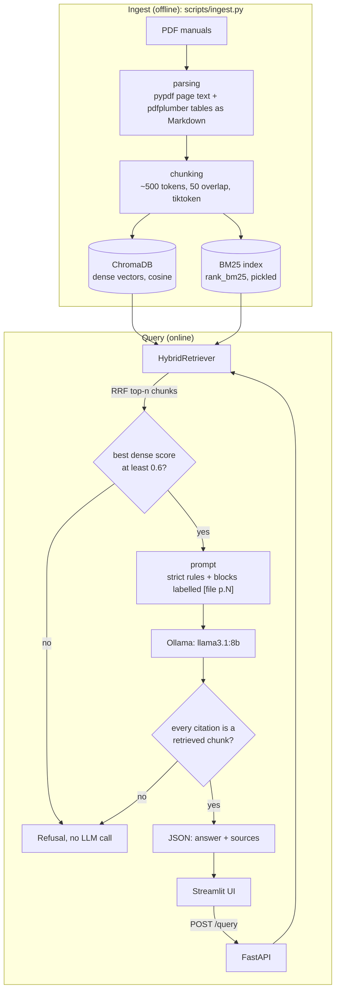

# Offshore Drilling RAG

A local question-answering system over offshore drilling and maritime manuals. Every answer is built only from retrieved manual text and carries a citation to the source file and page number (`[Drilling_Manual.pdf p.12]`). If the manuals do not contain the answer, the system refuses instead of guessing.

Everything runs on your own machine: no cloud API, no data leaves the computer.

## Design goals

- **No hallucination.** The model sees only retrieved chunks, under a strict system prompt. The API then checks in code that every `[file p.N]` citation in the answer points at a chunk that was actually retrieved, and refuses otherwise.
- **Verifiable.** Each answer comes with the source excerpts, so an engineer can check the claim against the manual page.
- **Local.** Embeddings run through `sentence-transformers`, the LLM through Ollama, the index in ChromaDB.

## Architecture



| Stage | Module | What it does |
|---|---|---|
| Parse | `src/rag/parsing.py` | Extracts text per page; converts tables to Markdown so rows stay readable |
| Chunk | `src/rag/chunking.py` | About 500-token chunks with 50 tokens of overlap; each keeps `source_file`, `page_number`, `chunk_id` |
| Dense index | `src/rag/vector_store.py` | ChromaDB collection `manuals`, cosine distance, embeddings from `BAAI/bge-small-en-v1.5`. Upserts by `chunk_id`, so re-ingesting is safe |
| Keyword index | `src/rag/bm25_index.py` | BM25 over the same chunks, saved to `data/bm25.pkl` |
| Fusion | `src/rag/hybrid.py` | Merges both rankings with Reciprocal Rank Fusion |
| Prompt | `src/rag/prompt.py` | Strict system prompt; each context block labelled with its exact citation string |
| LLM | `src/rag/llm.py` | `llama3.1:8b` through the `ollama` package, temperature 0 |
| API | `src/rag/api.py` | `/query` and `/health`; relevance gate and citation check |
| UI | `app/streamlit_app.py` | Question box, answer, one expander per cited source |

## Hybrid search: BM25 + dense vectors

Neither search method is enough alone for engineering manuals.

- **Dense vectors** (embeddings) match meaning. A question like "what equipment seals the well during a kick?" finds the blowout preventer section even though the words differ. They are weak on exact tokens: acronyms, part numbers and clause references can land far from the query in embedding space.
- **BM25** matches words. It scores chunks by how often the query terms appear and how rare they are across the corpus, so "BOP", "API 16A" or "5000 psi" are found reliably. It knows nothing about synonyms or paraphrase.

The system runs both on every question, taking the top 20 chunks from each, and merges the two ranked lists with **Reciprocal Rank Fusion (RRF)**:

```
score(chunk) = sum over each list that contains it of 1 / (60 + rank)
```

RRF uses only rank positions, not raw scores, so there is no need to normalise BM25 scores against cosine similarities, which are on different scales. A chunk that appears high in both lists gets the highest fused score. The top 5 fused chunks go to the model.

The fused RRF score is only an ordering. To decide whether the manuals are relevant at all, each chunk also keeps its raw `dense_score` (cosine similarity). If no retrieved chunk has `dense_score >= 0.6` (`MIN_DENSE_SCORE` in `src/rag/api.py`), `/query` returns the refusal message without calling the LLM. The threshold came from observed values (about 0.49 for off-topic questions and 0.73 to 0.86 for on-topic ones) and may need tuning on your own questions.

## Known limitations

- `MarineOffshoreLogOpsManual.pdf` is a scan with no text layer. There is no OCR, so it is not indexed; only the other 5 of the 6 manuals are searchable.
- The citation check proves the cited page was retrieved, not that the sentence is true. A model can still cite a real page for a wrong claim.
- The check can also refuse a correct answer that has no citation. That trade-off is deliberate.
- Answers are slow on CPU: the first query loads the 8B model and can take about 3 minutes; later queries are faster.
- The UI shows all retrieved sources, even when the answer used only one.

## Run it locally

### Prerequisites

- Python 3.10 or newer (developed on 3.14)
- [Ollama](https://ollama.com/) installed, with enough RAM for an 8B model
- Roughly 5 GB of free disk for the model, plus space for the embedding model and indexes

### 1. Clone and install

```bash
git clone https://github.com/Riz695/offshore-drilling-rag.git
cd offshore-drilling-rag
python -m venv venv
```

Activate the environment: `venv\Scripts\activate` on Windows, or `source venv/bin/activate` on macOS and Linux. Then:

```bash
pip install -r requirements.txt
```

### 2. Pull the LLM

```bash
ollama pull llama3.1:8b
```

On Windows you can move model storage to another drive first by setting the `OLLAMA_MODELS` environment variable.

### 3. Add the manuals and build the indexes

The PDFs are not in the repository (they are large and may be licensed). Put your own manuals in `data/raw_manuals/`, then run the ingestion script from the repository root:

```bash
PYTHONPATH=src python scripts/ingest.py
```

On Windows PowerShell: `$env:PYTHONPATH="src"; python scripts/ingest.py`.

This writes `data/chroma/` and `data/bm25.pkl`. Both are generated and git-ignored. Re-running is safe. Options: `--input`, `--chroma-dir`, `--bm25-path`.

### 4. Start the backend and the UI

Make sure Ollama is running (`ollama serve`, or the desktop app). Use two terminals, both from the repository root.

Terminal 1, the API:

```bash
PYTHONPATH=src python -m uvicorn rag.api:app --port 8000
```

Terminal 2, the UI:

```bash
streamlit run app/streamlit_app.py
```

Open http://localhost:8501 and ask a question, for example "What is a blowout?". The UI expects the API at `http://127.0.0.1:8000`.

You can also call the API directly:

```bash
curl -X POST http://127.0.0.1:8000/query \
  -H "Content-Type: application/json" \
  -d '{"question": "What does BOP stand for?", "top_n": 5}'
```

The response is `{"answer": "...", "sources": [{"source_file", "page_number", "chunk_id", "excerpt", "score"}]}`. An out-of-scope question returns the refusal text with an empty `sources` list.

### 5. Run the tests

```bash
python -m pytest tests -v                   # everything, including real PDFs and the real embedding model
python -m pytest tests -m "not integration" # fast tests only
```

`pytest.ini` sets the import path, so no `PYTHONPATH` is needed for tests. The unit tests use a fake embedder and a stub LLM, so they need neither Ollama nor model downloads; only the tests marked `integration` do.

## Repository layout

```
src/rag/            package: parsing, chunking, vector_store, bm25_index, hybrid, prompt, llm, api
app/                Streamlit UI
scripts/ingest.py   ingestion CLI
tests/              pytest suite (test-first; integration tests marked)
data/raw_manuals/   your source PDFs (git-ignored)
data/chroma/        generated vector index (git-ignored)
data/bm25.pkl       generated keyword index (git-ignored)
PLAN.md             phase plan
learning_notes.txt  running log of concepts and decisions
```

## License

MIT. See [LICENSE](LICENSE).
